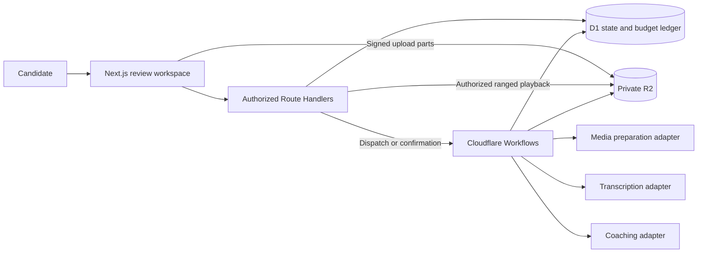
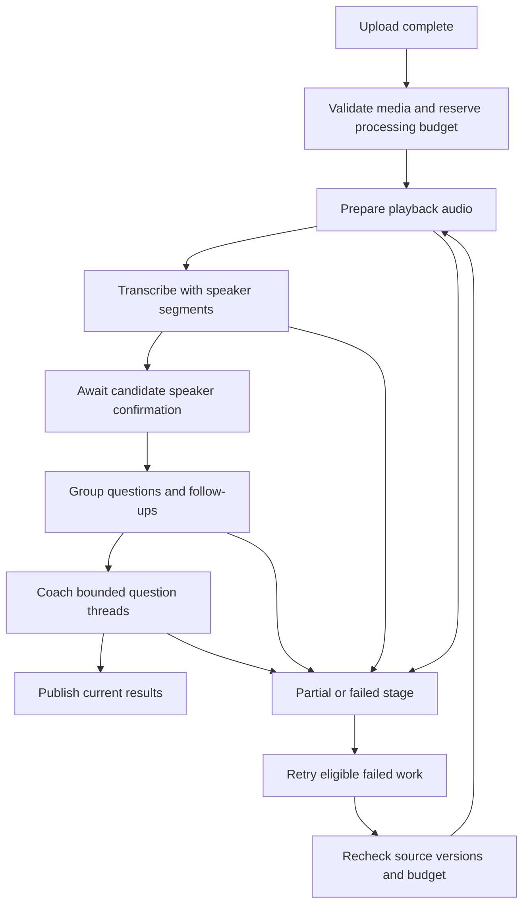

# Interview Coach AI — Architecture

Version: 0.3 · September 16, 2026 · Status: design for the confirmed recording pilot; not implemented

Product source: [PRD v0.5](PRD.md). Domain language: [CONTEXT.md](../CONTEXT.md). The existing app is a fictional frontend prototype. This document specifies the backend and workflow to build, not provisioned services or verified end-to-end behavior.

## 1. Architecture and boundaries

Keep one Next.js application with a small server-side review module on Cloudflare Workers, D1 for structured state, and private R2 for media and immutable documents. Use Cloudflare Workflows for durable staged processing. The browser starts work and observes persisted progress; it does not own execution lifetime. User-provided recordings of hiring and mock interviews use the same pipeline.

| Concern | Choice |
| --- | --- |
| App and UI | Next.js App Router, TypeScript, shadcn/ui, compact chronological question flow |
| Browser server state | TanStack Query; editor buffers and selection stay local |
| HTTP | Owner-authorized Route Handlers; short control requests, streaming media reads |
| Validation | Zod for HTTP, stored documents, and provider output; derive TypeScript types |
| Structured storage | D1 through Drizzle's SQLite/D1 driver; reviewed Drizzle Kit migrations |
| Object storage | Private R2 for recordings, playback audio, transcript versions, context, and results |
| Execution | Cloudflare Workflows with durable stage receipts and bounded retries |
| Deployment | Workers Builds; isolated preview and production resources |
| External processing | Selected media preparation, transcription, and coaching adapters; exact providers pending validation |
| Identity | Invited authenticated accounts before external access; provider remains to be selected |
| Evidence | Exact versioned transcript citations plus audio time ranges |
| Pilot continuity | Saved revisions and priorities; no theme service or theme aggregation |

Workflows checkpoints durable steps and supports waiting for events. This is a suitable orchestration layer for long recordings and human speaker confirmation; media conversion is a separate execution capability, not something Workflows or R2 supplies automatically. [Workflows guide](https://developers.cloudflare.com/workflows/get-started/guide/), [workflow events](https://developers.cloudflare.com/workflows/build/events-and-parameters/).

The former two-model-call, 90-second HTTP architecture is superseded. Do not put paid work in a request-lifetime callback or assume a browser connection remains open. See [ADR-0002](adr/0002-durable-recording-processing.md).

## 2. Module interfaces

Keep the review module responsible for ownership, storage publication, corrections, admissions, and result freshness. HTTP handlers translate validated requests into that interface. The workflow invokes the same domain operations; it must not bypass guards used by HTTP mutations.

| Module | Interface responsibility | Internal behavior |
| --- | --- | --- |
| Reviews | Create, list, read, update, delete | Owner checks, versions, annotations, object references |
| Uploads | Initiate, sign parts, complete, abort | Upload leases, byte limits, idempotent completion, admission |
| Processing | Start, confirm speakers, retry, inspect | Stage plan, dispatch, account job slot, dependency keys |
| Media preparation | Probe and produce playback audio | Container/codec validation, duration, audio extraction and time mapping |
| Transcription | Submit, reconcile, collect | Provider receipt, timestamps, speaker segments, uncertainty |
| Analysis | Group transcript and coach threads | Quote resolution, provenance checks, bounded context and output |
| Budget | Reserve, settle, reconcile | Atomic shared allowance and attempt ledger |
| Playback | Authorize and stream range | Review lifecycle, content type, HTTP range semantics |
| Cleanup | Revoke and remove | Workflow/provider cancellation, staged objects, deletion retries |

Provider adapters are small seams for real calls and deterministic fixtures, not a general multi-provider framework. No embeddings, crawler, practice generator, or independent theme store is needed.

Keep modules under the existing app layout unless restructuring serves a concrete implementation need. Server-only storage, credentials, and provider clients must never be imported by client components. These are interface contracts; this document does not prescribe unverified SDK signatures.

## 3. Storage model

Use normalized operational rows rather than putting the entire recording's lifecycle, attempts, and findings in one growing JSON manifest. D1 holds references and bounded metadata; large content stays in R2.

| Logical table | Required data and invariants |
| --- | --- |
| `pilot_accounts` | Auth subject, invitation state, configured recording allowance, used/reserved admissions, nullable active job ID |
| `reviews` | Owner, hiring/mock origin, title, role, lifecycle, row version, input revision, current artifact references |
| `uploads` | Owner/review, client action ID, multipart ID, object key, declared/observed bytes, lease, completion state |
| `recording_admissions` | Unique accepted upload/review, account, quota status; survives deletion as non-content usage accounting |
| `review_objects` | Review, opaque key, kind, hash, size/type, staged/attached/deleting state, lease |
| `processing_jobs` | Review/owner, action ID, input revision, plan version, workflow ID, stage, status, deadlines |
| `stage_results` | Job, stage/chunk identity, dependency key, source/result object references; unique reusable completion |
| `provider_attempts` | Operation/idempotency key, provider receipt, attempt status, reservation, usage and billing certainty |
| `budget_ledger` | Pilot limit and reserved/settled amounts in fixed-precision integer currency units |
| `review_annotations` | Saved future answers, result/thread references, at most three priorities, annotation version |
| `pending_events` | Durable workflow dispatch/confirmation intents for reconciliation after network failure |

Generate server IDs for artifacts and results. Client action IDs identify repeated HTTP actions; they never grant ownership. Store dates consistently and index owner/review, pending jobs, expiring uploads, and cleanup state. Apply uniqueness and conditional updates in D1, not only application checks. Use Zod and database constraints for allowed states and bounded fields.

Keep immutable R2 artifacts for the original upload, playback audio, initial transcription, corrected transcript versions, selected background/job text, grouping, and coaching. Exact hashes identify source versions; metadata records which provider/prompt/schema produced each derivative. An ETag is upload metadata, not an assumed SHA-256 content digest. Avoid cross-review object sharing in the pilot so deletion has a clear boundary.

Bound metadata, findings, text context, chunks, step count, and output sizes. Reject or split before a provider call or database write exceeds a limit; never drop saved work silently. Record the chosen limits during the provider/runtime spike. A 60-minute recording is not bounded by the old 8,000-word excerpt ceiling.

### Safe object publication

D1, R2, Workflows, and external providers do not share a transaction. Every boundary requires idempotency and recovery.

1. Reserve a staged object with an opaque key, owning review, purpose, and expiry before writing.
2. Upload/write and verify expected byte size, media type where relevant, and content integrity.
3. Atomically publish references and attach registry entries only if the review is active, the stage/input revision is current, and reservations are valid.
4. Failed publication leaves staged objects for cleanup. Cleanup must claim expired rows before deletion so it cannot race a successful attachment.
5. Keep tombstones and registry entries beyond outstanding upload/provider-write capabilities; remove late objects before final metadata cleanup.

A zero-row conditional update is not a failed transaction. Every dependent statement must share the successful-publication predicate, or the operation must explicitly roll back. Never assume a database batch rolls back because no row matched. Pruning must recheck current references, including saved answers and old evidence.

## 4. Upload and private playback

Use direct multipart R2 uploads for recordings rather than sending large media through JSON Route Handlers. The server authorizes initiation, reserves an allowance slot, assigns the key and multipart ID, and signs short-lived individual part uploads. Persist part receipts so interrupted uploads can resume while valid. The server owns completion and verifies the resulting object before admission. R2 supports multipart operations; browser signed requests require configured CORS. [Upload guide](https://developers.cloudflare.com/r2/objects/upload-objects/), [S3 compatibility](https://developers.cloudflare.com/r2/api/s3/api/), [presigned URLs](https://developers.cloudflare.com/r2/api/s3/presigned-urls/).

Enforce a configured total-byte ceiling, allowed part count/size, content type, and short upload lease. Declared MIME type and duration are untrusted: probe the actual media before paid transcription. Reject duration over 60 minutes and unsupported/no-audio/corrupt files explicitly. Configure incomplete multipart cleanup; release unused admission reservations when uploads expire. Closing the browser during upload can interrupt the transfer; durable processing is promised only after completion.

Only the selected media adapter extracts or transcodes audio. Do not assume FFmpeg runs inside a normal Worker or that R2 converts codecs. The provider/runtime spike must demonstrate the entire accepted format list, bounded extraction cost, audio quality, and a stable original-time mapping. Keep the original uploaded video even though the pilot plays only audio. A supported audio upload can reuse its source if suitable for playback; otherwise create a derivative.

For browser playback, use an authenticated owner-scoped endpoint that checks review lifecycle on every request and streams an R2 byte range. Implement `206`, `Content-Range`, content length/type, `Accept-Ranges`, and `416` behavior correctly; handle `If-Range` explicitly if supported. Use private/no-store caching and cancel playback/clear object URLs on deletion or logout. R2 supports ranged reads, but endpoint HTTP semantics are application responsibilities. [R2 Workers API](https://developers.cloudflare.com/r2/api/workers/workers-api-reference/).

Avoid long-lived bearer download URLs for browser playback because they weaken immediate access revocation. Any short-lived provider retrieval capability must be scoped to one object/operation; prefer revocable retrieval when supported. Account for already-issued signed URL expiry during deletion cleanup and document residual access rather than claiming revocation R2 cannot provide.

## 5. Durable processing lifecycle

The retry arrow represents recomputing the plan, not rerunning successful preprocessing. Reuse stage outputs with matching dependency keys and resume at the first missing/outdated stage. Persist progress/results in D1/R2 independently of workflow execution history. Pass only opaque IDs and artifact references in workflow parameters, returns, and events; avoid retaining recordings, transcript bodies, credentials, or signed URLs in workflow history.

### Dispatch and stage execution

Successful upload completion durably records the initial job and dispatch intent as part of the candidate's upload action; it does not require a second start click. Claim the account slot and required budget before automatic execution. If another job owns the slot, keep this intent waiting and resume when eligible; if budget is unavailable, expose a budget-blocked state. Later retries and reanalysis require an explicit candidate action. Use the job ID as a stable workflow-instance ID. Retry dispatch by inspecting that same instance, not creating a new job. A reconciler repairs the gap if D1 commits but the workflow creation response is lost. Return `202` with the job ID; the browser polls a read endpoint with backoff. Reads and refetches never start processing.

Each stage checks active review, job/input revision, dependency key, deadline, and budget before a side effect. Persist completion receipts so workflow replay can find already completed work. Chunk long transcriptions/grouping inputs deterministically where required, retaining source ranges and context overlap. Deduplicate boundary questions and include follow-ups before coaching. Use bounded per-thread or small-batch coaching so valid independent results can commit even if another thread fails.

Provider limits determine chunk/token ceilings, not a hard two-call promise. The plan must compute a finite maximum number of paid operations and reserve their cost. Never silently create an unbounded model repair loop or use repeated paid analysis to manufacture a complete-looking report.

### Human confirmation

Persist the detected speaker samples and initial transcript before requesting confirmation. The candidate maps one or more labels to themselves; other speakers can be interviewers or unknown. Store confirmation against the transcript/speaker version before delivering a workflow event. On wake, re-read D1 and verify the confirmed version; event payload alone is not authority. Cloudflare supports buffered events to an existing instance and configurable waits. [Events and parameters](https://developers.cloudflare.com/workflows/build/events-and-parameters/).

A missed event is redelivered from `pending_events`. An expired wait leaves the review awaiting confirmation, not approved or failed beyond recovery. Confirmation after expiry can dispatch a continuation job reusing saved artifacts. Waiting for the candidate does not perform paid work. It releases the account processing slot; confirmation reacquires the slot before coaching, or remains ready-to-resume if another job is active. The one-active-job rule governs running/queued automatic work, not an abandoned human wait.

### Retries and external side effects

Set retry and timeout policies explicitly for every stage. Safe reads/polls and transient storage failures can use bounded backoff. Paid submission requires a persisted operation key, conservative reservation, and provider idempotency or receipt reconciliation. An unknown submission outcome is not permission to submit again. Schema-invalid model output and unsupported media should stop or produce partial output, not trigger an automatic repair loop.

Cloudflare retries steps, so an external operation may have succeeded before a step failed to checkpoint. Durable execution alone does not supply exactly-once provider billing. Separate paid submission from polling and publication. Configure paid operations without automatic replay unless the chosen provider contract makes retries safe. [Rules of Workflows](https://developers.cloudflare.com/workflows/build/rules-of-workflows/), [retry configuration](https://developers.cloudflare.com/workflows/build/sleeping-and-retrying/).

An explicit retry gets a new job/action identity but reuses compatible completed stage outputs and known provider jobs. Reconciliation of unknown billing must precede new spending. Cancellation, elapsed deadlines, and exhaustion of attempts become durable states with an actionable UI. Configure stage and total automatic-work deadlines during the runtime spike; the human confirmation window is separate. No 90-second completion promise remains.

## 6. Transcript, evidence, and coaching contracts

The domain hierarchy is recording → versioned transcript utterances → exchanges → question threads → coaching results. A review owns these sources plus selected context and saved preparation. Hiring/mock origin does not change this hierarchy.

| Contract | Required meaning |
| --- | --- |
| Media artifact | Original or playback role, object ID/hash, duration, codec/type, mapping to original time |
| Utterance | Stable ID, transcript version/hash, exact text, speaker label/role, start/end milliseconds, uncertainty, original transcription reference |
| Text citation | Source ID/hash, exact quote, zero-based end-exclusive UTF-16 offsets into that source version |
| Audio anchor | Media artifact/version, original-time start/end; derived from transcription alignment, never invented by the coaching model |
| Exchange | Question and answer citations; direction; zero or more answer spans; optional parent exchange |
| Question thread | Main exchange plus follow-ups, stable source anchors, question types and uncertainty |
| Coaching result | Thread/input snapshot, outcome, supported findings, proposed segments, optional alternative, limitations, versions |
| Proposed segment | From interview answer, from selected background, or a question for the candidate; citations required for factual assertions |
| Saved revision | Candidate-authored future answer linked to its source thread/result, separate from interview evidence |

Persist word-level timestamps when available, otherwise use honest utterance-level playback. Do not claim exact word alignment after an edit if it is no longer known. Corrected text retains the enclosing original audio range and a visible correction marker; deleting/rephrasing transcript text cannot rewrite audio. Keep initial provider output and corrected versions immutable.

The model returns allowed source IDs and exact quotes, not trusted character offsets or invented timecodes. Resolve quotes on the server; repeated matches require an occurrence or surrounding anchor. Validate `source.text.slice(start, end) === quote`, source version, kind, and audio range bounds. Question/answer citations must reference transcript evidence; job text supports relevance, not achievement; factual alternative stories require background evidence.

Use Zod to validate shapes, lengths, enums, unique IDs, parent relationships, output limits, and stored schema versions. Parent links stay inside a thread/review and cannot cycle. Answers may be noncontiguous or absent. Preserve speech that is not a question card. Imported content is inert input, not model instructions. Structural validation cannot determine whether a quote semantically supports a recommendation; retain the PRD's independent review.

Grouping receives only transcript/source information and confirmed speaker roles. Coaching receives the relevant thread and selected role/background, with provenance boundaries. Skip claims dependent on unresolved audio/attribution and record why that portion is unavailable. A thread with an uncertain essential question cannot receive a confident coverage finding.

## 7. Corrections and concurrency

Maintain separate row versions for review inputs and saved annotations where useful; use conditional writes rather than whole-document replacement. Every input mutation increments its revision and marks dependent stage outputs outdated. Every generated commit checks active lifecycle, current job/generation, input revision, and dependency key. Never upsert a deleted review from a late result.

| Change | Invalidates | Reuse |
| --- | --- | --- |
| Transcript text correction | Affected grouping/coaching; broader grouping if boundaries may change | Original media, audio extraction, initial transcription |
| Speaker-role change | Affected attribution/grouping/coaching | Media and timestamped utterances |
| Question association correction | Corresponding threads and downstream advice | Transcript/audio and unrelated current threads |
| Role/background change | Coaching supplied that context | Transcript, confirmed speakers, grouping |
| Save answer/priority | No analysis stage | All processing outputs |

Dependency keys include all supplied content and relevant metadata, not only cited text. Correcting speaker roles matters even when the text hash is unchanged. Background sent to every coaching call invalidates every such result when changed. Reanalysis follows explicit candidate action; input corrections cancel/supersede affected active work and do not silently start another paid call.

Preserve old evidence when a saved answer points to an earlier result. If regrouping cannot map a thread confidently, keep the saved answer attached to its earlier snapshot and request local reassociation. Unaffected results remain readable; no stale result should be represented as current.

Annotation saves during processing must survive completion: merge generated fields into a fresh view, or write separate rows. Retry a database version conflict without repeating model calls. Return `409` with a safe conflict code on stale candidate edits; preserve editor buffers and fetch current state.

## 8. Admission, account slot, and the $50 budget

The three-recording allowance is configurable. Reserve an admission atomically when initiating upload; finalize it once a valid recording is admitted for processing. Release expired/invalid uploads. Retrying an admitted recording does not consume another admission, and review deletion does not reset usage. Keep minimal non-content usage records after deletion. Bound identical-completion requests with unique action/upload keys.

Claim one active automatic processing job per account using a transactional conditional update. Competing starts must not both succeed. Release the slot at terminal state or human/budget wait; reacquire before further processing. Stale slot recovery must inspect the job/workflow rather than launching a duplicate. A logical slot alone does not cancel a running provider operation; reconcile or cancel it before admitting overlapping automatic work.

Before paid work, reserve a conservative bound in a shared D1 ledger. The invariant is settled cost plus all outstanding reservations at or below $50. Use fixed-precision integer amounts and a single transactional balance guard across all five accounts; never enforce this with browser state or a per-workflow counter.

Calculate bounds from verified media duration, billable units, maximum input/output tokens, finite chunk counts, and allowed retry attempts. Paid media preparation is included. If probing itself costs money, reserve its bound before probing. Admit only a bounded plan that fits the remaining balance. Reanalysis and explicit retries need their own incremental reservations. If later evidence exceeds the reserved plan, pause before additional spending and reserve again rather than exceeding the cap.

Settle against returned usage or reconciled provider billing. Do not release unknown charges, including timed-out submissions, until reconciled. Deletion cancels future work but does not refund already incurred cost or release an unknown reservation. Retain only non-content receipts needed for this accounting.

The $50 value is accepted pilot policy, not evidence of affordability. Provider selection must verify price units, input/output bounds, cancellation/duplicate-charge behavior, and whether unknown attempts are discoverable. If a hard maximum cannot be established, do not claim the cap is enforced or open paid processing. Hosting/storage are separate and should be reported separately.

## 9. HTTP and browser state

| Operation | Behavior |
| --- | --- |
| Create review and initiate upload | Authenticate invite, validate metadata, reserve allowance, return upload instructions |
| Sign upload parts / inspect upload | Authorize review, validate part count/lease, issue scoped short-lived capability |
| Complete upload | Verify object and commit idempotently; durably schedule initial processing, return saved review and job receipt |
| Read review/job | Owner-scoped stage status, current/partial results, pending confirmation, safe error; no side effects |
| Confirm candidate speakers | Validate transcript version, persist mapping, dispatch durable wake/resume intent |
| Start/retry analysis | Explicit action ID and expected input version; enforce slot and budget; return `202` job receipt |
| Correct source/context/grouping | Conditional input change; mark dependent output outdated; no automatic reanalysis |
| Save answer/priorities | Annotation mutation only; maximum three priorities |
| Read playback range | Authorize active review and stream private audio bytes |
| Delete review | Tombstone immediately; `202` while cleanup pending, `204` after completed cleanup |

Return safe structured errors with operation/job IDs, conflict version where useful, and whether explicit retry is possible. Lost responses are recoverable through reads and action receipts. Do not make network retries equivalent to new paid actions.

TanStack Query owns reads, mutations, polling, and invalidation. Scope query keys to the signed-in owner and clear private caches on logout/identity change. Query keys are not authorization. Disable automatic mutation retries for paid actions; server-controlled bounded stage retries are distinct. Poll persisted progress with backoff, stop on terminal/human-wait states, and resume observation on return. Preserve unsaved editor text on refetch/conflict and refuse older returned versions that would roll back cache state.

Display upload, preparation, transcription, awaiting speaker confirmation, grouping, coaching, partial, ready, outdated, budget-blocked, failed, and deletion-pending states. These derive from persisted stage/result data rather than a second browser-authored execution state machine. Ready means current execution results, including honest abstentions; it does not certify the PRD's quality targets.

## 10. Deletion and security

First atomically tombstone the review, invalidate generation permissions, block reservations, and revoke browser playback. Then request workflow termination and provider cancellation where supported, abort multipart uploads, and delete every registered original/derived object, source/result snapshot, and annotation. Cloudflare exposes workflow termination; that does not establish cancellation or erasure at an external provider. [Triggering and stopping Workflows](https://developers.cloudflare.com/workflows/build/trigger-workflows/).

A late workflow step, callback, upload, or provider completion may still arrive. Authenticate callbacks where used and resolve them to known attempts; check lifecycle/version before publication. After deletion, discard content and arrange cleanup of provider-generated objects without recreating the review. Scheduled maintenance retries cancellations, expired uploads, dispatch reconciliation, and object deletion; it does not independently invent new paid jobs.

Keep tombstones/registries until outstanding capabilities and operations are expired or reconciled and late-write cleanup is complete. Distinguish immediate removal from application access, pending physical cleanup, and actual provider/backup retention. Do not report full cleanup while accessible registered media remains. Workflow history should contain only references; verify retention of any provider responses/errors and platform backups before the pilot.

Server-derived identity scopes every route, workflow operation, object read, and evidence link. Never trust owner IDs supplied by the browser. Enforce invite-only admission, same-origin/CSRF protection for cookie mutations, and safe text rendering. Restrict callbacks and media retrieval capabilities; this release accepts no arbitrary import URL, connected account, or executable upload.

Log opaque IDs, stages, elapsed time, safe errors, provider/prompt versions, and known usage. Exclude media, transcript/context text, prompts, secrets, and signed URLs from logs and error reporting.

## 11. Runtime verification and deployment

Pin and test the selected Next.js-to-Workers integration against this repo's installed version. Cloudflare currently documents vinext and OpenNext paths; compatibility has not been established for this project. Verify rendering, Route Handlers, private bindings, streaming playback, authentication, and workflow dispatch in the deployed runtime before selecting the adapter. [Next.js on Workers](https://developers.cloudflare.com/workers/framework-guides/web-apps/nextjs/), [OpenNext](https://developers.cloudflare.com/workers/framework-guides/web-apps/opennext/).

Deploy workflow code as a bound Worker if required by the selected integration. Verify workflow limits, step/event payloads, retry policies, and duration limits using the actual plan; do not assume Node.js server behavior. Read the installed Next.js guides before implementation. Test media preparation separately from request rendering—an adapter choice does not supply a media runtime.

Use separate preview/production D1, R2, workflow bindings, auth configuration, processor credentials, and budget ledgers. Workers Builds should install locked dependencies, run functioning lint/type checks and relevant tests, build the selected integration, apply reviewed backward-compatible migrations through a serialized step, then deploy. Current package scripts and dependencies still need this implementation work. A Worker rollback does not reverse database migrations or existing objects.

Before inviting candidates, verify the chosen identity/transcription/media/coaching providers; their retention and bounded cost; recording formats and byte limits; upload expiry and lifecycle; stage retry/deadline settings; and deletion cleanup against real isolated resources. No exact provider, resource IDs, credentials, or successful provisioning is implied here.

## 12. Verification plan and build sequence

| Scenario | Required result |
| --- | --- |
| Supported audio and video recording | Upload, probe, playback audio, transcription, confirmation, grouping, coaching, and saved answer complete |
| Unsupported codec, no audio, oversized/overlong input | Clear rejection before unbounded processing; unused admission and budget reservations handled correctly |
| Close browser after upload | Job progresses or awaits human confirmation; return restores progress and completed artifacts |
| Upload part retry / duplicate completion | No duplicate admission, object publication, or processing job |
| Panel interview / candidate split across labels | Correct candidate mapping; unknown/overlapping passages do not become confident advice |
| Event before wait / lost dispatch / confirmation after timeout | Persisted intent resumes correct version once; no time-based implicit approval |
| Transcription completed; coaching fails | Transcript/flow and independent successful results remain usable; retry does not retranscribe |
| Provider submission succeeds but response is lost | Receipt/idempotency reconciliation; unknown cost remains reserved; no blind resubmission |
| Two accounts spend last remaining budget | Only affordable reservations commit; shared cap holds under concurrency |
| Two jobs for one candidate | At most one automatic job owns the slot; queued/resumed work respects it |
| Source correction during generation | Old output cannot publish as current; annotations and unchanged evidence survive |
| Repeated quotes, Unicode, corrected wording | Exact versioned text references; honest audio range, no fabricated word-level alignment |
| Citation is valid but claim is unsupported | Independent review flags semantic failure; structural tests do not claim to detect it |
| Delete during upload, extraction, or coaching | Access denied immediately; late writes never restore review; cleanup retries to completion |
| R2 succeeds and D1 publication fails | Staged orphan cleaned; no broken visible reference |
| Two owners request one media/review ID | No cross-owner bytes, progress, or evidence returned |
| Browser range playback and keyboard review | Correct seek/range behavior, accessible controls, and usable partial/error states |
| Preview deployment | Production data, budgets, and credentials remain isolated |

Use deterministic adapters for replay, concurrency, malformed output, timeout, and deletion tests. Use local D1/R2 and workflow testing where supported, plus isolated deployed smoke checks for upload/playback/provider behavior. Model and transcription quality require the PRD's permissioned recordings and independent review; passing application tests is not quality validation.

Build authentication/provider-runtime feasibility first, then private intake and accounting, durable transcription/speaker confirmation, grouping/coaching with evidence, corrections/saved work, and finally the pilot plus quality evaluation. Recurring themes, live/practice interviewing, account-connected ingestion, video playback, and delivery assessment remain deferred.

## Local-first implementation checkpoint

The user has prioritized completing the application and validating local development before further cloud CI/CD work. A ticket's locally verified implementation may unblock the next ticket while remote acceptance remains explicitly outstanding.

For the first audio slice, multipart parts use bounded binary requests (5 MiB maximum) through an owner-authorized Worker endpoint into private R2. Five-minute HMAC capabilities bind each request to its owner, review, upload, and part; the server stores immutable part hashes and R2 receipts. This deliberately replaces direct S3 presigning for the local slice so local R2 needs no cloud API keys. It does not send recordings through JSON bodies. Direct-to-R2 presigning remains a future transport optimization if needed; the lifecycle, quota, integrity, and deletion invariants remain server-owned.

`worker.js` delegates app requests to OpenNext and runs cleanup every 15 minutes via a scheduled handler. Local status requests also reconcile expired reservations. Failed cleanup remains a tombstone and yields HTTP 202; retries and scheduled sweeps remove objects without restoring access. Upload rows retain opaque object keys and admitted counts after content deletion. Before any remote rollout, provision the declared private R2 buckets and retain incomplete-multipart lifecycle expiration to cover a process crash between R2 multipart creation and registration of its returned ID.

The local preparation implementation keeps the initial dispatch intent on `processing_jobs.dispatch_state`, inserted in the same D1 batch as admission. The job ID is `prepare-<upload ID>`; idempotent Workflow batch creation recovers a lost dispatch response. The preparation checkpoint fits in bounded D1 JSON and references the original R2 key and exact SHA-256, without creating another media object. Workflow execution lives in a separate job Worker so both `next dev` and the built app use the same durable runner. Local development starts that Worker automatically and simulates its cron event every 15 seconds. Production uses the configured cron schedule.

Ticket #4's local media adapter is a separate Node.js/FFmpeg process, reached only through an authenticated loopback endpoint by the local Worker. It accepts bounded binary media, disallows network protocols and non-video demuxers, probes actual streams and duration, and extracts one audio track. The Worker registers each derivative implicitly through the retained upload ID (`audio/<upload-id>/<attempt-id>`), verifies it, and publishes only under the active job/revision predicate. Cleanup always covers that derivative prefix, including after deletion or a late write. This is a free local adapter; remote runtime validation is outstanding. FFmpeg [stream probing](https://ffmpeg.org/ffprobe.html) and [protocol restrictions](https://ffmpeg.org/ffmpeg-protocols.html) inform the process boundary.
